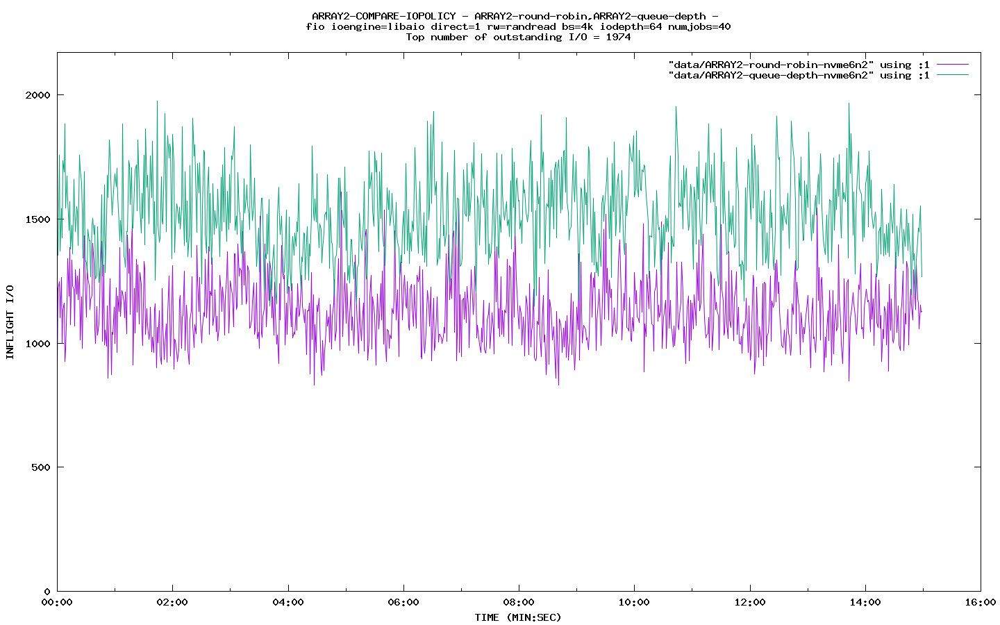
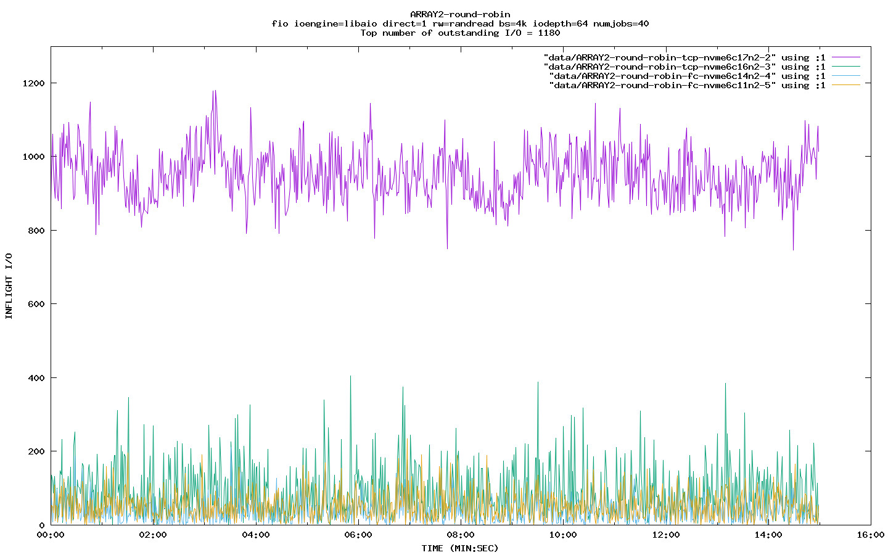
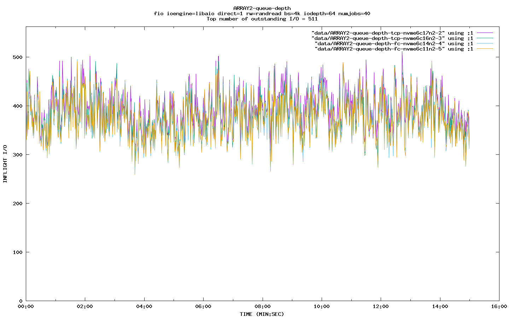

# Linux NVMe iopolicy tests

This repository contains scripts used to generage work loads and collect
data that can be used to analyze different nvme multipath iopolicies.

To change your nvme multipath policy you set the `/sys/class/nvme-subsystem`
iopolicy parmeter. For example:

```
 # modinfo nvme_core | grep iopolicy
 parm:           iopolicy:Default multipath I/O policy; 'numa' (default) , 'round-robin' or 'queue-depth'
 cat /etc/

 # cat /sys/class/nvme-subsystem/nvme-subsys0/iopolicy
 numa

 # echo "round-robin" > /sys/class/nvme-subsystem/nvme-subsys0/iopolicy

 # cat /sys/class/nvme-subsystem/nvme-subsys0/iopolicy
 round-robin
```

## Prerequsites 

Testbed setup should include an NVMe-oF multipath capable target (a storage
array or Linux soft-target) with at least 4 paths (the more paths the better)
serving a single 400GB namespace and an NVMe-oF host system. It is best to use
real hardware if you can.

You will need root access to your host. All tests will be run from the `root`
account on the NVMe-oF host.

Install the following packages on your NVMe-oF host:

```
# on Fedora Centos-stream-9
dnf config-manager --set-enabled crb
dnf install -y epel-release epel-next-release
dnf install -y fio sysstat gnuplot gimp

# on Fedora
dnf install -y fio sysstat gnuplot gimp
```

## Quickstart

1. clone this repository on your test host
2. log into the *root* account, you'll need two or three login sessions to run the test
 1. one to run the fio command
 2. one to run the collection script
 3. one to run the iostat command (if desired)
3. `cd` to a scratch subdirectory
* both the fio script and the data collection scripts will create data collection files in your *pwd*
* it is recommended to create a new subdirectory for each test run
4. run the `start_collection.sh` script and follow the directions.

For example:

```
[root results12]# /home/test/setup/iopolicy/start_collection.sh "numa,round-robin,queue-depth,latency" ARRAY1 nvme12n1 300

Be sure to start fio in a separate shell with start_fio.sh

     "start_fio.sh <disk> <block_size> <runtime> <numjobs> <iodepth>"

 e.g: "/home/test/setup/iopolicy/start_fio.sh nvme12n1 1024k 1500 127 127"

Monitor progress with iostat

 "iostat -x ID $(cat /proc/diskstats | fgrep nvme12 | fgrep n1 | awk '{print $3}' | sort -r) 4"

Type any key to continue, e to exit:

nvme-subsys12/iopolicy is numa
setting iopolicy for nvme-subsys12 to numa
Creating file cfgs/ARRAY1-numa.cfg
Creating file /run/ARRAY1-numa
Done with /run/ARRAY1-numa
nvme-subsys12/iopolicy is numa
setting iopolicy for nvme-subsys12 to round-robin
Creating file cfgs/ARRAY1-round-robin.cfg
Creating file /run/ARRAY1-round-robin
Done with /run/ARRAY1-round-robin
nvme-subsys12/iopolicy is round-robin
setting iopolicy for nvme-subsys12 to queue-depth
Creating file cfgs/ARRAY1-queue-depth.cfg
Creating file /run/ARRAY1-queue-depth
Done with /run/ARRAY1-queue-depth
nvme-subsys12/iopolicy is queue-depth
setting iopolicy for nvme-subsys12 to latency
Creating file cfgs/ARRAY1-latency.cfg
Creating file /run/ARRAY1-latency
Done with /run/ARRAY1-latency
```

Following the test run the data collection files be created in your `pwd`.

```
[root results12]# ls
ARRAY1-latency  ARRAY1-numa  ARRAY1-queue-depth  ARRAY1-round-robin  ARRAY2-numa  ARRAY2-round-robin  cfgs  logs
```

You can generate the gnuplot graphs by running the `process_inflight-data.sh` script.

```
[root results12]# /home/test/setup/iopolicy/process_inflight-data.sh -n "ARRAY1-latency,ARRAY1-numa,ARRAY1-queue-depth,ARRAY1-round-robin"
Creating ARRAY1-latency.jpeg for nvme12n1
1 nvme12n1 == data/ARRAY1-latency-nvme12n1-1
2 nvme12c16n1 == data/ARRAY1-latency-fc-nvme12c16n1-2
3 nvme12c15n1 == data/ARRAY1-latency-fc-nvme12c15n1-3
4 nvme12c12n1 == data/ARRAY1-latency-fc-nvme12c12n1-4
5 nvme12c11n1 == data/ARRAY1-latency-fc-nvme12c11n1-5
gluplot -p ARRAY1-latency.gpd
Done with ARRAY1-latency

Creating ARRAY1-numa.jpeg for nvme12n1
1 nvme12n1 == data/ARRAY1-numa-nvme12n1-1
2 nvme12c16n1 returned no data.
2 nvme12c15n1 returned no data.
2 nvme12c12n1 == data/ARRAY1-numa-fc-nvme12c12n1-2
3 nvme12c11n1 returned no data.
gluplot -p ARRAY1-numa.gpd
Done with ARRAY1-numa

Creating ARRAY1-queue-depth.jpeg for nvme12n1
1 nvme12n1 == data/ARRAY1-queue-depth-nvme12n1-1
2 nvme12c16n1 == data/ARRAY1-queue-depth-fc-nvme12c16n1-2
3 nvme12c15n1 == data/ARRAY1-queue-depth-fc-nvme12c15n1-3
4 nvme12c12n1 == data/ARRAY1-queue-depth-fc-nvme12c12n1-4
5 nvme12c11n1 == data/ARRAY1-queue-depth-fc-nvme12c11n1-5
gluplot -p ARRAY1-queue-depth.gpd
Done with ARRAY1-queue-depth

Creating ARRAY1-round-robin.jpeg for nvme12n1
1 nvme12n1 == data/ARRAY1-round-robin-nvme12n1-1
2 nvme12c16n1 == data/ARRAY1-round-robin-fc-nvme12c16n1-2
3 nvme12c15n1 == data/ARRAY1-round-robin-fc-nvme12c15n1-3
4 nvme12c12n1 == data/ARRAY1-round-robin-fc-nvme12c12n1-4
5 nvme12c11n1 == data/ARRAY1-round-robin-fc-nvme12c11n1-5
gluplot -p ARRAY1-round-robin.gpd
Done with ARRAY1-round-robin
```

This creates .jpeg graph output files with gnuplot in your current directory.

```
[root results12]# ls *.jpeg
ARRAY1-latency.jpeg  ARRAY1-numa.jpeg  ARRAY1-queue-depth.jpeg  ARRAY1-round-robin.jpeg
```

## How It Works

The the `collect_inflight-data.sh` and `inflight-data.sh` scripts count outstanding IOs by colleting the
diskstats for the specified disk and controllers with:

```
for i in `seq 1 $count`
do
    cat /proc/diskstats | fgrep ${ctrl} | fgrep ${ns}
    sleep 1
done
```

This produces a data collection file that looks like the following:

```
 259      10 nvme1c13n1 85277 0 5457728 193826 85254 0 5456256 205968 10 20064 399795 0 0 0 0 0 0
 259      14 nvme1c6n1 84927 0 5435328 12597600 84413 0 5402432 12399966 1255 20063 24997566 0 0 0 0 0 0
 259      18 nvme1c15n1 84365 0 5399360 12515932 84845 0 5430080 12465887 1281 20064 24981820 0 0 0 0 0 0
 259       2 nvme1c1n1 13710957 0 877498184 1013488092 13709671 0 877418944 1016044032 15 871107 2029532125 0 0 0 0 0 0
 259       3 nvme1n1 13980309 0 894736712 1040119717 13978576 0 894628864 1042438027 2560 871107 2082557744 0 0 0 0 0 0
```

### System Configuraiton and Test Logs

Also generated by the `collect_inflight-data.sh` and the `start_collection.sh` scripts are the files in the "cfgs" and "logs" directories. These files contain nvme controller configuration information and error message information from `dmesg` for each data collection run.  For example:

```
> cat cfgs/ARRAY1-TCP-queue-depth.cfg
/sys/class/nvme-subsystem/nvme-subsys6/iopolicy is : queue-depth
----------------------------------------------------
controller  : /sys/class/nvme-subsystem/nvme-subsys6/nvme6/nvme6c6n1
ana_state   : optimized
transport   : tcp
queue_count : 81
sqsize      : 127
numa_node   : -1
----------------------------------------------------
controller  : /sys/class/nvme-subsystem/nvme-subsys6/nvme7/nvme6c7n1
ana_state   : optimized
transport   : tcp
queue_count : 81
sqsize      : 127
numa_node   : -1
----------------------------------------------------
controller  : /sys/class/nvme-subsystem/nvme-subsys6/nvme8/nvme6c8n1
ana_state   : optimized
transport   : tcp
queue_count : 81
sqsize      : 127
numa_node   : -1
----------------------------------------------------
controller  : /sys/class/nvme-subsystem/nvme-subsys6/nvme9/nvme6c9n1
ana_state   : optimized
transport   : tcp
queue_count : 81
sqsize      : 127
numa_node   : -1
```

The `start_fio.sh` script create two files called `system.cfg` and `fio.txt`
these files contain infomatoin about the testbed configutaiton for the test
run.

## Creating Graphs

The `process_inflight-data.sh` and `compare-inflight-data.sh` scripts process
the diskstat data collected by the data collection scripts.  The number of
outstanding requests on the device is extracted from this data collection file
with the following script:

```
do
        grep "${fdisk}" ${inputfile} | awk '{print $12}' > data/${inputfile}${trans}-${fdisk}-${i}
done
```

This produces an output data file in a subdirectory called "data" that looks
something like: `ARRAY2-TCP-queue-depth-nvme2n1-1`.  Esch controller specific
data collection file is then used to create gnuplot script called
"${filename}.gpd". This ".gpd" file is then used by gnuplot to generate at
graph with the command `guplot -d ${filename}.gdp`.

# Sample Data

The following graphs are from the `sample1` directory that has been added to this
repository as a demonstration of the output from these scripts.

## Compare Outstanding IOs per Namespace

 

## Compare Outstanding IOs per Controller

 
 
